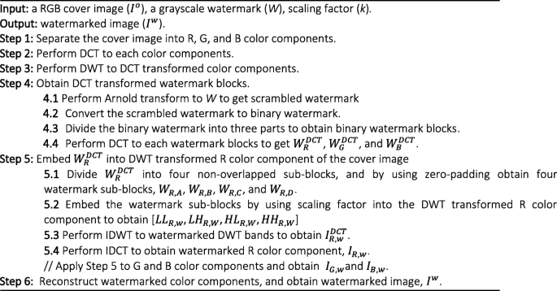
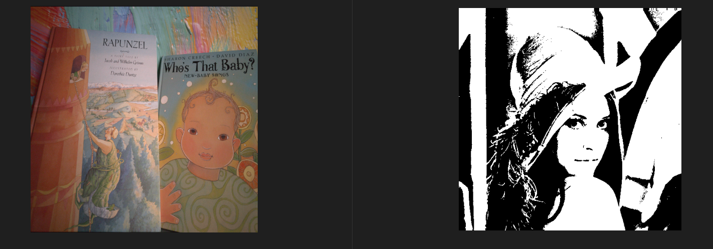
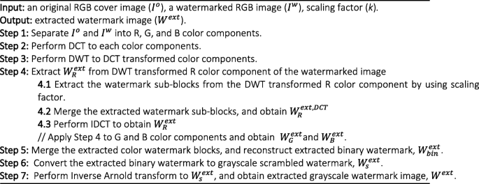
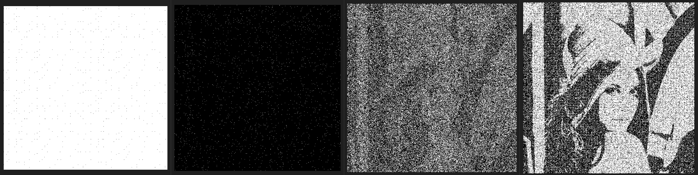
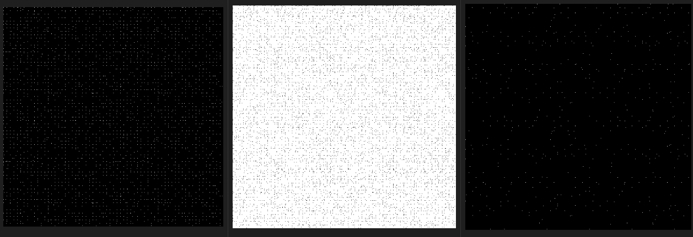
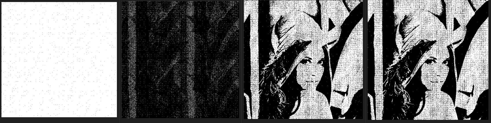
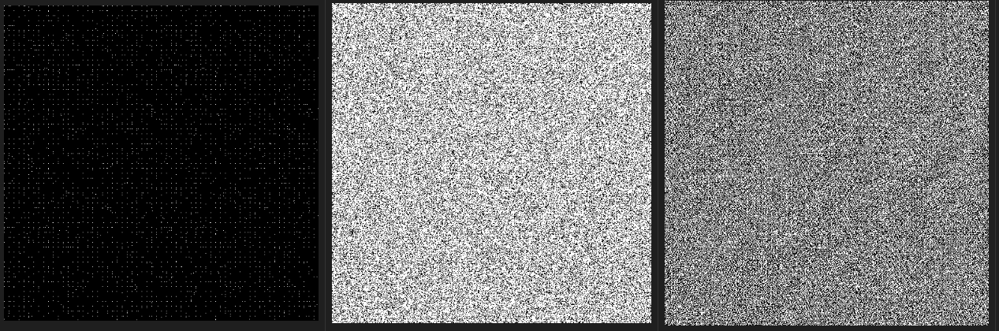

# Watermark Embedding Using DWT, DCT, and Arnold Transform
This project implements the algorithm proposed in the paper: "A Novel Hybrid DCT and DWT Based Robust Watermarking Algorithm for Color Images" by Ahmed Khaleel Abdulrahman and Serkan Ozturk.

The authors proposed a robust color image watermarking method that combines: Discrete Cosine Transform (DCT), Discrete Wavelet Transform (DWT), Arnold Transform for scrambling, RGB channel separation and embedding.

## Method Summary
### Embedding Process

#### Cover Image and Watermark/Payload

#### Watermarked images with different embedding strengths 

L-R | Strength 0.01       | Strength 0.1     | Strength 1      |

| Strength | PSNR (dB) | SSIM    |
|----------|-----------|---------|
| 0.01     | 44.19     | 0.9885  |
| 0.1      | 28.97     | 0.8685  |
| 1        | 17.94     | 0.3729  |

As the embedding strength increased, we observed that the quality of the watermarked output degraded. It becomes more obvious that the original image has been tampered with. At embedding strength 1, periodic artifacts from the DCT blocks can visibly been seen on the watermarked image. On the other hand, strenght 0.01 provided a better quality. This is reflected in the  PSNR and SSIM values computed.  

### Extraction Process

#### Embedded and Extracted Watermark

L-R | Embedded Binary Image       | Extracted Binary Image    | 

| PSNR (dB) | SSIM    |
|-----------|---------|
| 8.41      | 0.0745  |

### Extraction Process
To check the robustness of the method, seven attacks were selected namely; affine, filtering with gaussian blur,jpeg compression, noise addition, scaling, shearing and translation.

#### Extracted Watermarks from attacked images with embedding strength 0.01

L-R| affine| gaussian blur| jpeg compression| noise additon

L-R| scaled| sheared| translated

#### extracted watermarks quality of varios attacks
|Attacks   | PSNR (dB) | SSIM    |
|----------|-----------|---------|
| affine   | 5.81      | 0.4247  |
| filtered | 5.23      | 0.0015  |
| jpeg     | 5.71      | 0.0104  |
| noise    | 6.98      | 0.0350  |
| scaled   | 5.23      | 0.0018  |
| sheared  | 5.80      | 0.1184  |
| translate| 5.22      | 0.2950  |
#### watermarked image quality of before extraction
|Attacks   | PSNR (dB)  | SSIM    |
|----------|------------|---------|
| affine   | 17.98      | 0.3160  |
| filtered | 32.59      | 0.8112  |
| jpeg     | 29.54      | 0.6409  |
| noise    | 28.02      | 0.6603  |
| scaled   | 16.05      | 0.3288  |
| sheared  | 15.64      | 0.2999  |
| translate| 19.47      | 0.2950  |

#### embedding strength of 1

L-R| affine| gaussian blur| jpeg compression| noise additon

L-R| scaled| sheared| translated

### Conclusion
From our results, it is observed that the algorithm showed mild robustness to noise addition,compression and guassian blur attacks. While an increase in the embedding strength did improve the robustness to these attacks, the quality of the watermarked image degraded and it became quite obvious that the image had been manipulated. This is consistent with the theory on the tradeoff between perceptibility and robustness. However, for  shearing, translation, scaling and affine attacks, the algorithm did not show any robustness at all. The entire extracted payload was lost. Part of the reason for this could be attributed to the nature of these attacks. They cause distortions that tend to displace or shift some parts of the image. It could also be thought of as geometric attacks. This did not improve even when the embedding strength was increased. So a special embedding and extraction process that takes into account some of these movements could be explored to further improve results from such attacks.

