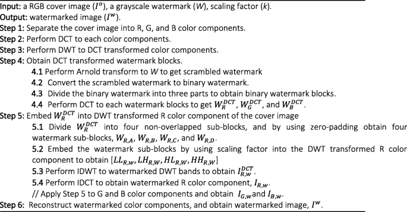
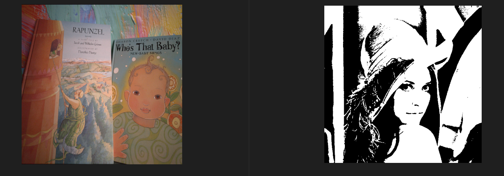
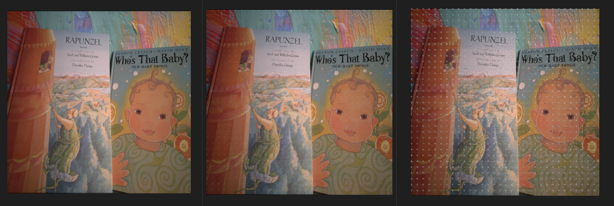
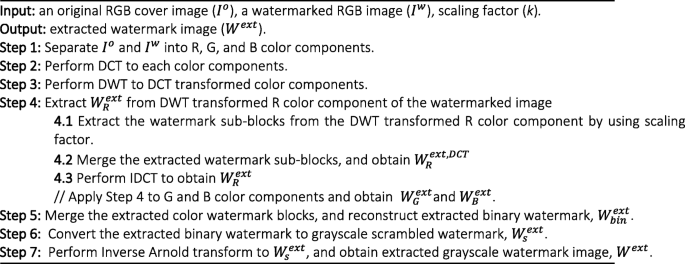
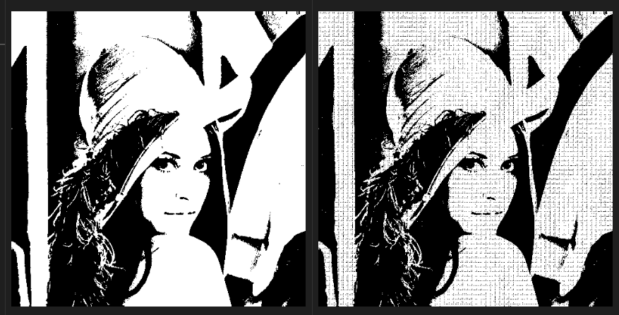

# Watermark Embedding Using DWT, DCT, and Arnold Transform
This project implements the algorithm proposed in the paper:

"A Novel Hybrid DCT and DWT Based Robust Watermarking Algorithm for Color Images"
by Ahmed Khaleel Abdulrahman and Serkan Ozturk.

The authors proposed a robust color image watermarking method that combines:

* Discrete Cosine Transform (DCT)

* Discrete Wavelet Transform (DWT)

* Arnold Transform for scrambling

* RGB channel separation and embedding

## Method Summary
### Embedding Process

#### Cover Image and Watermark/Payload

#### Watermarked images with different embedding strengths 

L-R | Strength 0.01       | Strength 0.1     | Strength 1      |

| Strength | PSNR (dB) | SSIM    |
|----------|-----------|---------|
| 0.01     | 44.19     | 0.9885  |
| 0.1      | 28.97     | 0.8685  |
| 1        | 17.94     | 0.3729  |

As the embedding strength increased, we observed that the quality of of the watermarked output degraded. As it become more obvious that the original image has been tampered with. At embedding strength 1, periodic artifacts from the DCT blocks can visibly been seen on the watermarked image. On the other hand, strenght 0.01 provided a better quality metrics for both PSNR and SSIM.  

### Extraction Process

#### Embedded and Extracted Watermark

L-R | Embedded Binary Image       | Extracted Binary Image    | 

| PSNR (dB) | SSIM    |
|-----------|---------|
| 8.41      | 0.0745  |

